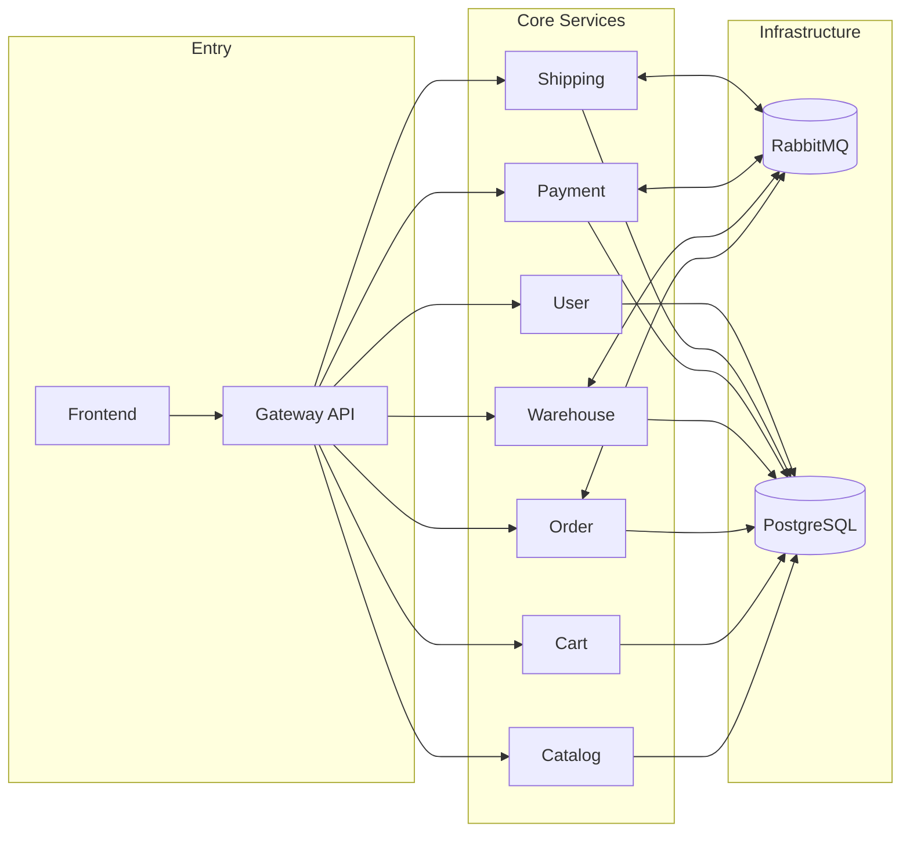

# CQRS E-Commerce Microservices (Docker-First)

Professional starter kit for a basic e-commerce platform built with CQRS, Event Sourcing, and async messaging.

## Highlights
- `.NET 10` Minimal API microservices
- CQRS and event sourcing with `Wolverine + Marten`
- RabbitMQ for async workflows
- PostgreSQL for documents, streams, and Wolverine durability
- YARP gateway (`/api/{service}/...`)
- Fast frontend with `Astro SSR + Svelte + Nanostores + Tailwind`
- One-command docker orchestration

## Quick Start
1. Copy env file:
   ```bash
   cp .env.example .env
   ```
2. Build and start everything:
   ```bash
   docker compose up --build -d
   ```
   Note: PostgreSQL creates one dedicated database per microservice on first init. If you already have old volumes, run `docker compose down -v` once before restarting.
3. Check health:
   ```bash
   docker compose ps
   ```
4. Open UI:
   - `http://localhost:3000`

## Architecture



## Services and Ports
- Frontend: `http://localhost:3000`
- Gateway: `http://localhost:8080`
- Gateway Scalar UI: `http://localhost:8080/scalar`
- Gateway OpenAPI JSON: `http://localhost:8080/openapi/v1.json`
- RabbitMQ Management: `http://localhost:15672` (`guest/guest` by default)
- PostgreSQL: `localhost:5432`

Internal service names in Docker network:
- `catalog-api`, `cart-api`, `order-api`, `warehouse-api`, `payment-api`, `shipping-api`, `user-api`

## Payment Provider Mode
- `payment-api` supports provider-oriented session flow for hosted redirect + future S2S callback.
- Environment variable:
  - `PAYMENT_PROVIDER_MODE=redirect` (default): creates payment sessions (`/v1/payments/sessions/...`) and waits for explicit authorize/reject.
  - `PAYMENT_PROVIDER_MODE=auto`: authorizes immediately (legacy/demo automation).
