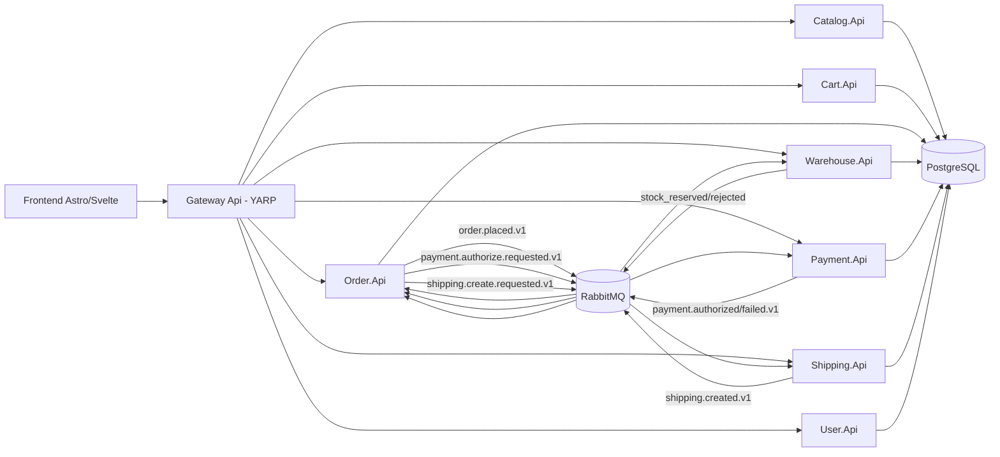
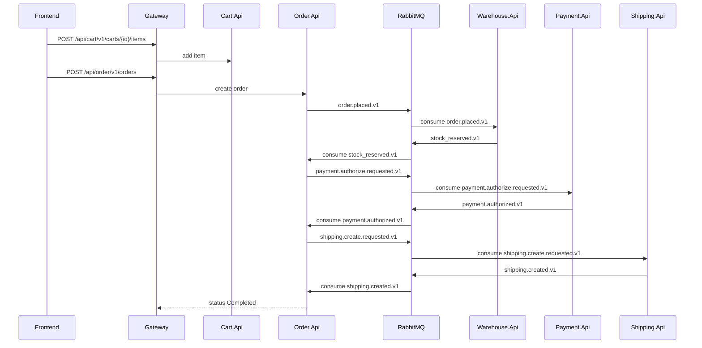
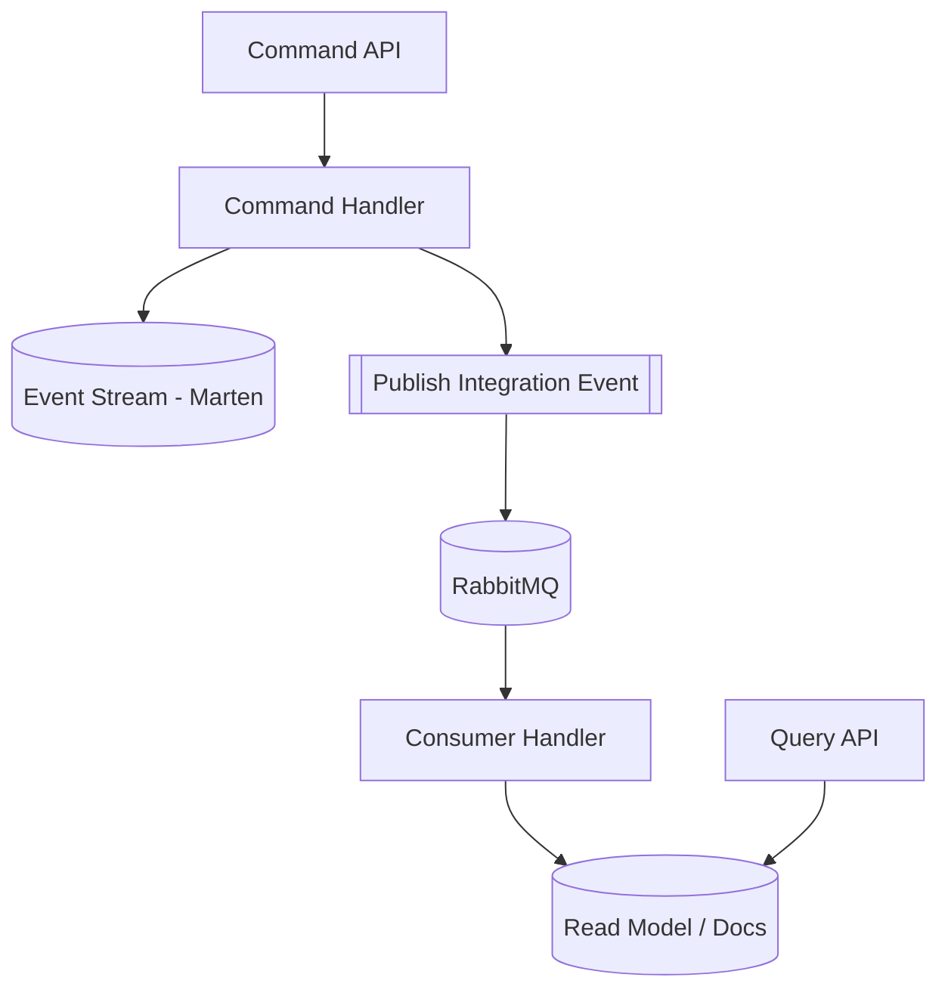

# CQRS E-Commerce Microservices (Docker-First)

Professional starter kit for a basic e-commerce platform built with CQRS, Event Sourcing, and async messaging.

## Highlights
- `.NET 10 Preview` Minimal API microservices
- CQRS and event sourcing with `Wolverine + Marten`
- RabbitMQ for async workflows
- PostgreSQL for documents, streams, and Wolverine durability
- YARP gateway (`/api/{service}/...`)
- Fast frontend with `Astro SSR + Svelte + Nanostores + Tailwind`
- One-command docker orchestration

## Architecture







## Services and Ports
- Frontend: `http://localhost:3000`
- Gateway: `http://localhost:8080`
- RabbitMQ Management: `http://localhost:15672` (`guest/guest` by default)
- PostgreSQL: `localhost:5432`

Internal service names in Docker network:
- `catalog-api`, `cart-api`, `order-api`, `warehouse-api`, `payment-api`, `shipping-api`, `user-api`

## Quick Start
1. Copy env file:
   ```bash
   cp .env.example .env
   ```
2. Build and start everything:
   ```bash
   docker compose up --build -d
   ```
3. Check health:
   ```bash
   docker compose ps
   ```
4. Open UI:
   - `http://localhost:3000`

## API Examples
Get catalog:
```bash
curl http://localhost:8080/api/catalog/v1/products
```

Add item to cart:
```bash
curl -X POST http://localhost:8080/api/cart/v1/carts/<cartId>/items \
  -H 'Content-Type: application/json' \
  -d '{
    "userId": "aaaaaaaa-aaaa-aaaa-aaaa-aaaaaaaaaaaa",
    "productId": "11111111-1111-1111-1111-111111111111",
    "sku": "SKU-KEYBOARD-001",
    "name": "Mechanical Keyboard",
    "quantity": 1,
    "unitPrice": 89.99
  }'
```

Create order:
```bash
curl -X POST http://localhost:8080/api/order/v1/orders \
  -H 'Content-Type: application/json' \
  -d '{"cartId":"<cartId>","userId":"aaaaaaaa-aaaa-aaaa-aaaa-aaaaaaaaaaaa"}'
```

Get order:
```bash
curl http://localhost:8080/api/order/v1/orders/<orderId>
```

## Seed and Load
Run product seed manually:
```bash
docker run --rm \
  --network cqrs-ecommerce_default \
  -v "$PWD:/workspace" \
  -w /workspace \
  node:20-alpine \
  node scripts/seed-and-smoke.mjs
```

Run load script from host (Node 20+):
```bash
node scripts/load-checkout.mjs
```

Optional tuning:
```bash
ITERATIONS=100 CONCURRENCY=10 node scripts/load-checkout.mjs
```

## Project Structure
```text
src/
  Catalog.Api/
  Warehouse.Api/
  Shipping.Api/
  Order.Api/
  Cart.Api/
  User.Api/
  Payment.Api/
  Gateway.Api/
  Shared.BuildingBlocks/
frontend/web/
scripts/
docs/adr/
```

## Troubleshooting
- Containers not healthy:
  - `docker compose logs <service>`
  - verify RabbitMQ and PostgreSQL are healthy first
- Need clean restart:
  ```bash
  docker compose down -v
  docker compose up --build -d
  ```
- Seed products manually:
  ```bash
  docker run --rm --network cqrs-ecommerce_default -v "$PWD:/workspace" -w /workspace node:20-alpine node scripts/seed-and-smoke.mjs
  ```

## Performance Notes
- Async workflow removes synchronous coupling in checkout path.
- Event sourcing keeps immutable history for Cart and Order streams.
- Read side is optimized by direct document/query access.
- Wolverine durable messaging on PostgreSQL improves delivery reliability.

## Security and Current Limits
- No authentication/authorization in this phase.
- Demo-only validation and payment simulation.
- No PII storage beyond demo user profile.
- Next step: add auth, idempotency hardening, OpenTelemetry traces/metrics.

## Open Source and Commercial Use
All selected technologies are open-source and suitable for commercial use under their respective licenses:
- .NET (MIT)
- Wolverine/Marten (OSS permissive)
- RabbitMQ (MPL 2.0)
- PostgreSQL (PostgreSQL license)
- Astro/Svelte/Tailwind/Nanostores (OSS permissive)
